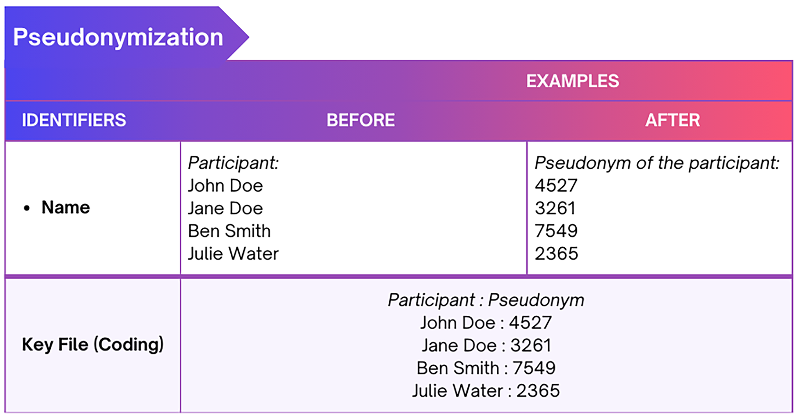
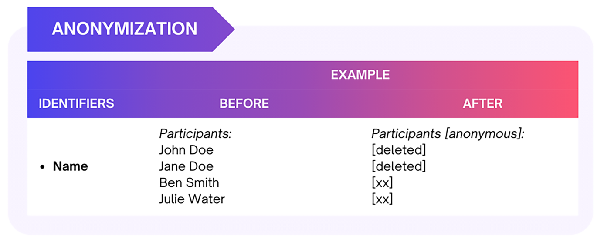
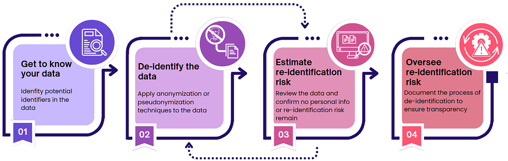

# Principles, concepts and practical considerations {#minimization}

## Data minimization

*Data minimization* is a fundamental principle of data privacy, as emphasized under the GDPR. It requires limiting data collection and retention to only what is **relevant**, **necessary**, and **adequate** to accomplish a given purpose. 

Collecting only the minimum amount of personal data necessary for your research reduces the risks associated with excessive data collection. More personal data implies bigger risks of data breaches and their misuse, thereby increasing potential consequences for the research participants.

In line with this principle, a researcher should only collect and retain the personal data that is required for the intended research study. Personal data minimization in research can be achieved by:


<ul>
  <li><details><summary><b>**Carefully planning what personal data is necessary for your research purpose. **</b></summary>
  <div>Plan what specific personal data is truly needed early in the research design phase. For example, avoid collecting participants' ages if your study does not examine age-related effects.<br></div>
  </details></li>
  <li><details><summary><b>**Collecting aggregated information when detailed information is not required. ** </b></summary>
  <div>If broader categories (e.g., age ranges) suffice for your analysis, there's no need to collect exact ages.<br></div>
  </details></li>
  <li><details><summary><b>**Limiting open-ended questions in surveys.**</b></summary>
  <div>Open-ended responses occasionally include personal data about the respondents themselves or others. Reducing the number of open-ended questions can minimize the risks of collecting unnecessary personal data.</div></details></li>
  <li><details><summary><b>	**Instructing research participants sufficiently to avoid unnecessary personal data.** </b></summary>
  <div>Inform participants ahead of the survey and interview to refrain from sharing unnecessary personal information, such as names or addresses of others.  Adding clear instructions and reminding the participants not to mention personal data (e.g., other people's names or addresses) is well worth the effort and can prevent unintentional personal data collection.</div></details></li>
    <li><details><summary><b>	**Adjusting the settings of the data collection tool (e.g., survey tools) to minimize personal data collection. ** </b></summary>
  <div>Review and configure tools like survey platforms to prevent the default collection of unnecessary personal data, such as location or IP addresses. Always check and adjust settings to align with the data minimization principle. When data collection is finalized, please migrate personal data from the data collection tools to safe data storage as soon as possible. 
  </div></details></li>

</ul>


## Pseudonymisation versus Anonymisation  


When personal data are necessary and have been collected for research, research participants’ identities should be protected. Two techniques- **pseudonymisation** and **anonymization** are used to ensure that research participants remain anonymous and untraceable during and after research. 


**Pseudonymisation**

*Pseudonymisation* is a de-identification process after which personal data can no longer be attributed to a specific data subject without the use of additional information. This process is also referred to as coding. It involves creating <u> **two separate files**</u>, one linking the personal data to the pseudonyms (made-up values/tokens) and another file which contains only the pseudonyms and the supplied research information. The former file is known as **a key file** or **code list** and must be kept separately from the latter file. 

The key file should be securely stored and protected with measures such as password protection and encryption to prevent the re-identification of research participants.

```{r pseudo-key,fig.align='center',fig.width=10, fig.height=7, out.width="80%", echo=FALSE}
   
```

**Anonymisation**

*Anonymisation* is another de-identification process which involves permanently deleting direct and/or indirect identifiers from the data, such that there is no way to link back to individuals (research participants) and the research information they have supplied. In this case, there is <u>no key file</u> that would permit re-identification as this process is irreversible. 


```{r anonymization_example,fig.align='center',fig.width=10, fig.height=7, out.width="80%", echo=FALSE}
   
```

Figure XX. Anonymization of names

Pseudonymization differs from anonymization as it is a reversible process due to the key file and re-identification is possible. Anonymization is irreversible as all identifiers are removed and there is no key file (see Figure XX) thus re-identification is not possible.


:::{.bubble}

Pseudonymization differs from anonymization as it is a reversible process due to the key file and re-identification is possible. Anonymization is irreversible as all identifiers are removed and there is no key file (see Figure XX) thus re-identification is not possible.
:::


```{r comparison_pseu_anony,fig.align='center',fig.width=10, fig.height=7, out.width="80%", echo=FALSE}
  knitr::include_graphics("figure/comparison_pseu_anony.png") 
```

## Data anonymisation process

Data anonymisation is an iterative process.  The figure below presents the important steps, considerations and actions necessary to ensure an effective and informed data anonymisation process.


The setps for anonymization can be found in the table below @UK_Data_Service,@PDPC. 
```{r anonymization_steps,fig.align='center',fig.width=10, fig.height=7, out.width="99%", echo=FALSE}
   
``` 
Figure x. Steps to de-identify your data. (Note: Adapted from UK Data Service and PDPC Singapore)


**1. Get to know your data**

Identify any direct and/or indirect identifiers in your dataset. See Chapter 1 for a detailed overview of identifiers. 

***How to:*** 

Knowing your data involves answering questions such as: what type of data do you want to anonymize or pseudonymize (e.g., textual, numerical, audio, video)? What identifiers are present, such as direct, strong, indirect, or weak indirect identifiers?

**2.De-identify your data**

Select and apply anonymization or pseudonymization techniques to the data. See Chapter 3 for an overview of the techniques. Be consistent when applying the selected techniques throughout the dataset.

***How to:*** 

Ask yourself how you could de-identify the data while retaining its usefulness. This will involve considering the data type, format, sensitivity, uniqueness, intended use and reuse of the data. Finally, the de-identification process should be documented to ensure transparency.


**3. Assess re-identification risks** 

Identify any direct and/or indirect identifiers in your dataset. See Chapter 1 for a detailed overview of identifiers. 

***How to:*** 

Three techniques commonly used to assess re-identification risks are:

•	Singling Out: can an individual be isolated from the dataset?
•	Linking: can information within the dataset be combined with external data to identify an individual?
•	Inference: can details about an individual be inferred, guessed, or predicted based on patterns in the dataset or previous knowledge

Therefore, assessing re-identification can involve reviewing the data to confirm that no personal data or significant re-identification risks remain by:

<ul>
  <li><details><summary><b>**Checking unique data records**</b></summary>
  <div>Are there any remaining sensitive or unique data points in the dataset? Check if any data points are unique in combination with other attributes. If a category created by any two attributes (e.g., age and occupation) has only one data point, that data point is unique and poses a re-identification risk. Aim to have at least three data points in each unique category to reduce this risk.<br></div>
  </details></li>
  <li><details><summary><b>**Assessing sample vs population unique data records:** </b></summary>
  <div>Uniqueness in a dataset sample can still mean uniqueness in the broader population and an increased re-identification risk. For example, a rare disease patient or a specialized surgeon might be unique both in the dataset and in real life, making them identifiable.<br></div>
  </details></li>
  <li><details><summary><b>**Investigating the existence of:**</b></summary>
  <div>o	**External databases or any other information**: assess whether other datasets or any knowledge that could be used to re-identify your data exist.
  
  o	**Re-identification technology and skills**: assess if (new) techniques and skills that could reverse anonymization or link data back to individuals exist.
  </div></details></li>
</ul>


**4.	Manage re-identification risk. **

Full anonymization is difficult, if not impossible, to achieve. Once data is made available, it can potentially be linked to external datasets, making it possible to re-identify individuals. Additionally, various (new)new techniques could emerge and enable re-identification. Therefore, when making data available, extra care should be taken to minimize re-identification risks.


***How to:*** 

•	Specify access levels and conditions for who will access the data (e.g., a specific group or the general public). The broader the recipient range, the stricter the anonymization measures should be. 

•	Apply additional safeguard measures such as encryption, password protection, etc.

•	Ensure that, where necessary, legal agreements are arranged (e.g. data transfer or sharing agreements).


## Practical Consideration
<ul>
  <li><details><summary><b>**Anonymization is not an absolute value, but a spectrum.**</b></summary>
  <div>In the following scenarios, data cannot be considered anonymized:
  
o	If the dataset still contains identifiable data. 

o	If the key files or any other information that could be used to re-identify individuals remain available (shared alongside the dataset orelsewhere), the data cannot be deemed anonymised. The data is instead considered **pseudonymized**. 
<br></div>
  </details></li>
  <li><details><summary><b>**Balancing anonymization and data usefulness.** </b></summary>
  <div>Anonymization can reduce data utility, potentially limiting its use and reuse in future studies. The more the data is anonymised (by removing or altering personal identifiers), the less useful it may become for research. Therefore, sometimes personal details may need to be preserved, at least during the research, to maintain the data’s usefulness. For example, in a study examining the relationship between students' performance and family socioeconomic status, key information such as grades and family income must be retained to answer the research question while personal details like names, gender, and age might be removed to protect privacy. <br></div>
  </details></li>
  <li><details><summary><b>**Pseudonymization may be preferred over anonymization.**</b></summary>
  <div>Anonymization may not always be desirable, during and after research. For example, in longitudinal studies, tracking the same participants over time is crucial. In such cases, **pseudonymization** is preferred over anonymization, as it allows researchers to link data across multiple different time periods. Similarly, for qualitive studies, pseudonymization may be preferred over anonymization to retain the context and richness of the data. </div></details></li>
  
  <li><details><summary><b>	**Sharing anonymised data.** </b></summary>
  <div>There is always a risk of data re-identification through singling out, inference, or linking with other data or techniques. Therefore, it is recommended to carefully assess these risks before sharing data. If the risk of re-identification is high, the scope of data sharing should be limited, and conversely, if the risk is low, the scope of sharing can be broader.</div></details></li>
    
  <li><details><summary><b>	**Documenting the anonymization process.** </b></summary>
  <div>Anonymization process should be thoroughly documented for future reference, mainly for transparency but mostly to ensure data usability. Such documentation tracks all changes, including removals, replacements, aggregations, or generalizations. The anonymisation documentation should be stored securely and separately from the data files, as it may contain information that could enable re-identification. </div></details></li>
    <li><details><summary><b>	**Fully anonymized data is not subject to GDPR** </b></summary>
  <div>Unlike pseudonymized data, fully anonymized data is not subject to GDPR regulations. However, it is worth noting that **full anonymization is challenging to achieve**. </div></details></li>
  
</ul>
