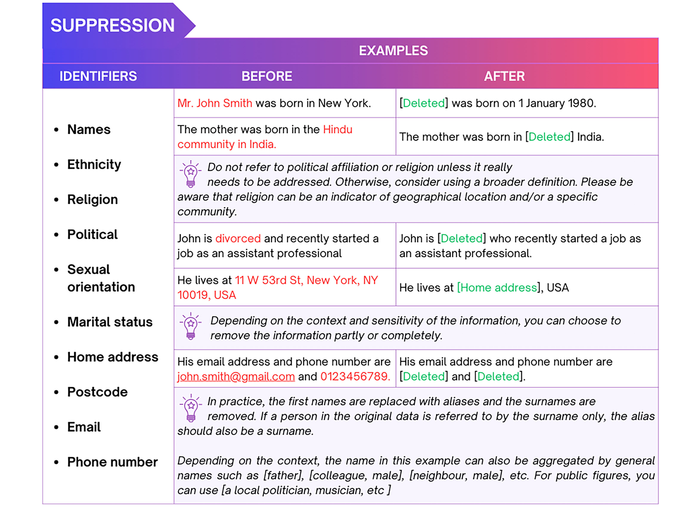
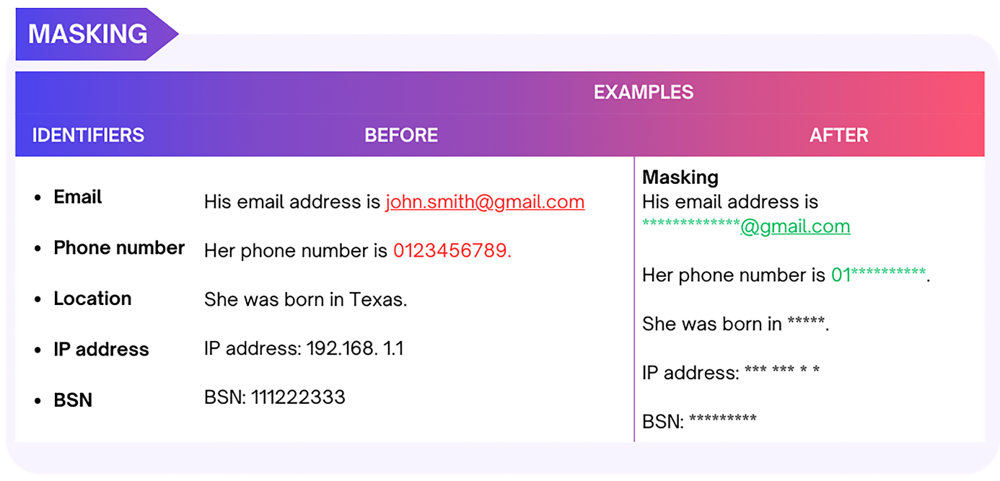

# Pseudonymization and Anonymization Techniques  {#textual}

Pseudonymisation and anonymisation techniques vary depending on the types and nature of the data. This guide will discuss the techniques for the following types of research data: **textual data**,**numerical data**, **audio and visual data**, and **geospatial data**.


## Textual data

Textual data refers to any text-based content such as transcripts of interviews, workshops and focus group discussions, open-ended questions in surveys, observational notes, meeting notes, etc. This data type can be de-identified by generalizing the identifying information, distorting or deleting the identifiers such as research participants' names, gender, age, income, places and institutions names, addresses (physical location, email and IP), telephone numbers and any other sensitive information. The following techniques are commonly used to pseudonymize or anonymize textual data.


### Generalisation: Replace or aggregate

Generalization involves reducing detailed information or the precision of the information in a way that potentially disclosive information is replaced or aggregated.

This approach mainly involves replacing or aggregating identifiers with vague descriptors, such as replacing the actual names of individuals with aliases or with other aggregated information.


```{r textual_generalization,fig.align='center',fig.width=10, fig.height=7, out.width="98%", echo=FALSE}
  knitr::include_graphics("figure/textual_generalization.png") 
```


### Distort

In certain cases, instead of generalizing crucial information needed to understand the context and content, it's possible to distort the information by changing other identifiers. 

For example, if you have interviewed someone who participated in a high-level sports competition, and if that information is of importance in research, then you may change other values. You could change the years when the competition took place, the region (place, country) or even the gender of the person if this is not crucial information. 


### Suppression: Delete 
 
If the identifying information cannot be replaced or generalized, the entire variable or text may need to be deleted and explicitly marked as such by using [brackets].  


```{r anony_vis1,fig.align='center',fig.width=12, fig.height=9, out.width="95%",echo=FALSE}
   
```

### Masking 

Masking textual data involves replacing letters or symbols (punctuation) in identifying information entirely or partially with a special symbol (such as '*' or 'x'). It is commonly used for identifiers such as email addresses, names of locations, etc.  

This technique is more suitable for structured tabular data, meaning that data is stored in the form of columns and rows.


```{r mask_textual,fig.align='center',fig.width=10, fig.height=7, out.width="90%", echo=FALSE}
   
```


For more inspiration on how to anonymize textual data, please consult this illustrative example provided by [CESSDA](https://dmeg.cessda.eu/Data-Management-Expert-Guide/5.-Protect/Anonymisation), which demonstrates the process of anonymizing an **interview transcript**. 


