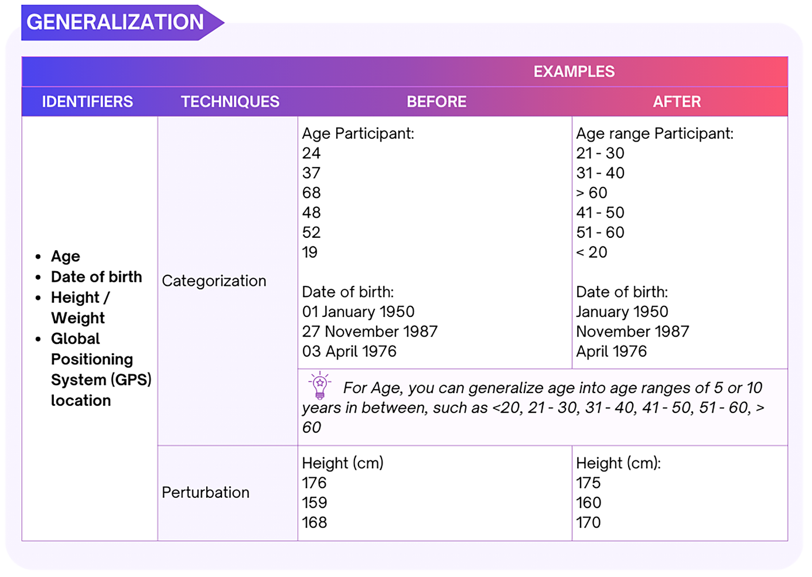

# Numerical data {#numeric}

Numerical data consist of numbers and is commonly organised in a table with rows and columns. Rows represent observations or attributes of each data subject, while columns display values for various variables or attributes of interest to researchers. 

**Generalisation **

Generalisation techniques reduce the granularity of the attributes/records in the data. It can be performed by:  

(1) **Categorising personal identifiers*. For example, age is replaced by an age category or range. Geographic units are formed by combining all ZIP codes with the same four initial digits, which contain more than 20,000 people.  

(2) **Top and bottom coding of the upper or lower ranges**. Very high and low values are grouped into categories to minimise identifiability due to outliers. For example, ages above or below certain limits are classified as groups to prevent the identification of exceptionally older or younger individuals. A top code of“X or more”could be applied to avoid identifying older subjects.  

(3) **Collapsing and/or combining variables**. Merging data recorded in two or more variables into a single category. This is particularly useful if the initial data collection creates several categories with very few data subjects in each.  

(4) **Perturbation** can be used where small changes in value are acceptable. This technique involves **rounding**, **adding noise**, or **replacing actual values with simulation values**. It should not be used when data accuracy is critical.  

For examples on how to generalise (categorise and perturbate numerical data), see Figure 9. 


```{r numeric_generalization,fig.align='center',fig.width=10, fig.height=7, out.width="80%", echo=FALSE}
   
```


**Rounding**

Rounding returns a number rounded to a base number to reduce precision. It can be used to deal with personal data, such as age, height and weight. Various tools can be used to apply the rounding technique, such as Excel, R, or Python.  

For instance, it is possible to use the MROUND function in Excel to round numerical identifiers. MROUND function will round the original value to a nearest value that is estimated by dividing the base number that is selected as parameter. For example, the function will turn the age of 44 to 40 when the base number is 20. Other practical examples of rounding are demonstrated in Figure 10.

```{r rounding,fig.align='center',fig.width=10, fig.height=7, out.width="80%", echo=FALSE}
  knitr::include_graphics("figure/rounding.png") 
```

**Noise addition**

Noise addition involves adding or subtracting the original values with a random number. This can be done manually or by means of tools such as Excel, R, or Python. The technique can be used for a few values in a dataset, such as outliers, or for the entire dataset. Large random values result in higher levels of noise. 

As a practical example, adding noise to the identifier “age” with R involves the following two steps:
  
  (1)generate a noise parameter using the sample(1:n) function to create a random number between 1 and n;  
  (2)add or subtract this noise value from the original age. For instance, if the original age is 44 and the noise parameter is 5, the modified age becomes 49. 

See Figure 11 for additional examples of noise addition. 

Note that the results of noise addition are irreversible because each modification introduces randomness to the original values. Furthermore, when handling data with one or more continuous variables, the distribution of continuous variables should be preserved to maintain more information in the data.  


```{r noise_addition,fig.align='center',fig.width=10, fig.height=7, out.width="90%", echo=FALSE}
  knitr::include_graphics("figure/noise_addition.png") 
```


**Suppression**  

Suppression involves deleting identifying information from the data. Some attributes (variables) or records (observations) can be removed in some instances to make the identifier no longer unique. This is useful, for example, in the case of outliers that can easily allow the re-identification of an individual.  

**Swapping** 

The swapping technique is also known as **shuffling** or **permutation** to alter the association between the participants and their attributes. For instance, consider a dataset with 100 participants labelled as Participant 1 through Participant 100. Each participant has attributes such as income, education level, and job position. To reduce the risk of re-identification, attributes can be swapped between participants, for example exchanging the income of Participant 1 with that of Participant 50 and shuffle the job title for Participant 1 and Participant 87. By swapping the income and job title of participants, it reduces the likelihood of identifying an individual through both attributes. This process can be applied across the entire dataset, which effectively breaks the direct link between each participant and their original set of attributes. 

In this way, the distribution of the data would not be changed even though each participant’s attributes are altered.  

Note: This technique should not be used when the data has been collected to study relationships between attributes of the same research participants, such as the association between a job position and education level for each participant in the previous example. 

**Masking numerical data** 


Masking numerical data involves entirely or partially replacing digits with special symbols (such as `*` or `x`) in the same way words are masked in textual data as described in section 3.1. For instance, it is possible to use the `REPLACE` function in Excel to mask numerical identifiers such as phone number, income, email, IP address, etc. 

The `REPLACE` function requires three inputs: 

1. The cell containing the original value, identified by its column and row (e.g., `A2`).  
2. The starting and ending position of the digits/characters within all content stored in the cell to be replaced.  
3. The symbol used to replace the original digit(s)/character(s), such as `*` or `x`.

As an example, to mask the first three digits of an income value '58435' in cell A2 in Excel, the following formula can be used: Replace (A2, 1,3, `*`), which returns '***35 '. Additional examples of masking are shown in Figure 12. 

```{r mask_numeric,fig.align='center',fig.width=10, fig.height=7, out.width="90%", echo=FALSE}
  knitr::include_graphics("figure/mask_numeric.png") 
```

