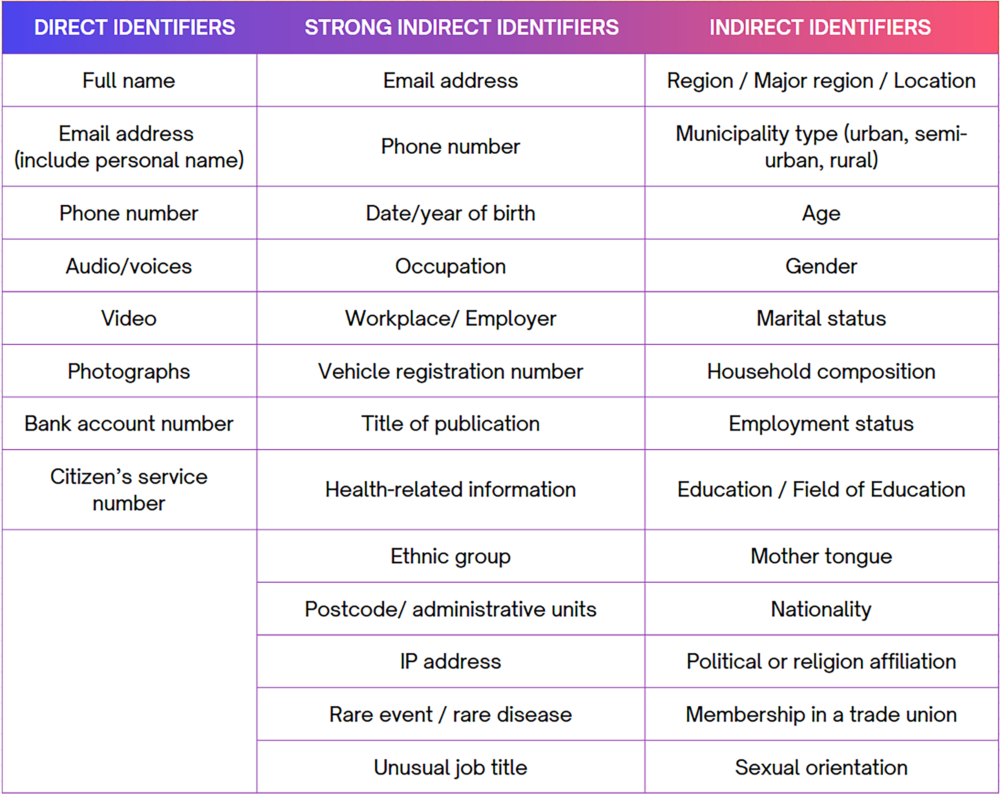
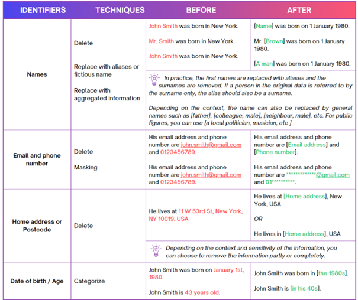
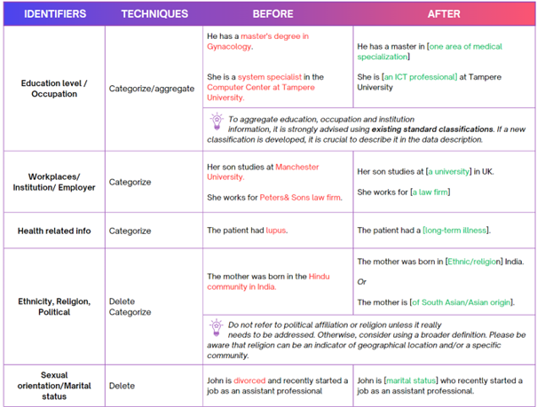
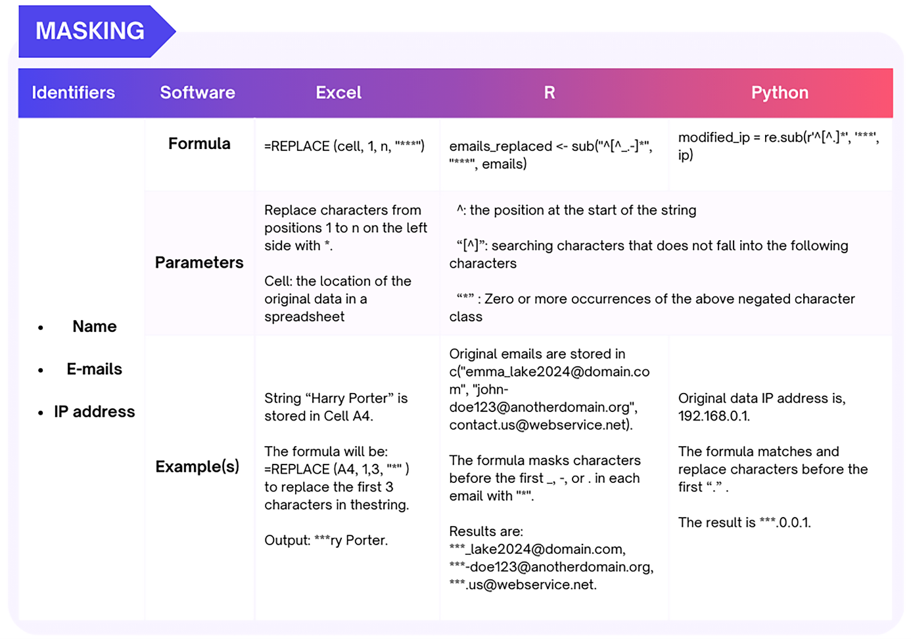
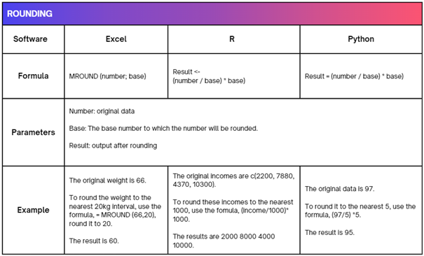
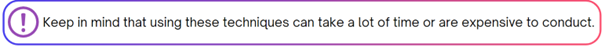
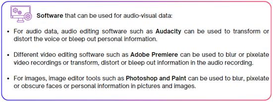
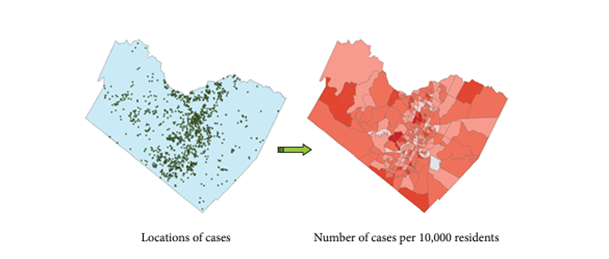
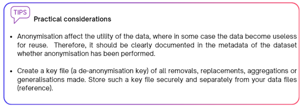

--- 
title: "A Practical Guide to Data Anonymisation"
author: "Alice Nikuze, Deiniece  Nazareth, Minsi Li"
date: "2024-08-30"
site: bookdown::bookdown_site
documentclass: book
bibliography: [book.bib, packages.bib]
# url: your book url like https://bookdown.org/yihui/bookdown
# cover-image: path to the social sharing image like images/cover.jpg
description: |
  This is a minimal example of using the bookdown package to write a book.
  set in the _output.yml file.
  The HTML output format for this example is bookdown::gitbook,
#link-citations: yes
#github-repo: rstudio/bookdown-demo
favicon: figure/favicon.ico
apple-touch-icon: "figure/logo.jpeg"
apple-touch-icon-size: 180
output:
  html_document:
  theme: yeti
  toc: true
  toc_float: true

---


# Introduction


In today's data-driven world, privacy concerns have become paramount. With the increasing collection of personal data in research, researchers bear the responsibility of ensuring the protection of the privacy rights of the individuals participating in their studies. In addition, the General Data Protection Regulation (GDPR) in Europe requires researchers affiliated with any institution within the European Economic Area (EEA) to protect the privacy of research participants if they handle personal data in their research. In this context, the more personal data are collected, the greater the need for data de-identification.


``` r
  knitr::include_graphics("figure/introduction.png")
```


<div class="pink-box">

This guide provides practical guidance on pseudonymizing and anonymizing personal data in research- the two data de-identification approaches. It includes examples of various techniques for different types of research data and is structured as follows:

•	In **Chapter 2**, the term "personal data" is defined.

•	In **Chapter 3**, the principle of data minimisation is introduced.

•	In **Chapter 4**, the concepts of data pseudonymisation and anonymisation are explained.

•	In **Chapter 5**, the pseudonymization and anonymisation techniques for different types of research data, mainly textual data, numerical data, audio and visual data and spatial data are discussed. Practical examples regarding these types of data are given.

•	In **Chapter 6**, the guide concludes with some practical considerations.
</div>


:::note

This guide is produced by data stewards in University of Twente (UT).We welcome feedback and contributions of any type, please read our for more information.
:::

:::warning

If you work at the University Medical Centre Utrecht (UMCU) or any other institution outside of Utrecht University, some of the guidelines in the Data Privacy Handbook may not be in line with your institutional guidelines. Please consult with your local privacy staff whenever you are in doubt about this.
:::

## Disclaimer

The content presented in this Practical Guide to Data Anonymisation has been carefully curated by data steward in University of Twente.  

This practical guide is a 'living' book that is continually being written, 
updated and reviewed. Its contents can therefore change, or become outdated or 
redundant. Hence, the information presented is provided "as is", **without 
guarantees of accuracy or completeness**.

As scientific research may differ depending on the discipline, topic, and 
context, measures needed or taken to ensure GDPR-compliance will vary across 
research projects. The authors can therefore **not be held responsible, nor 
accountable** for any negative consequences arising from interpretation and use 
of the content of this guide.

**For the most up-to-date and official/
authoritative information, please refer to the 
[university website](https://www.utwente.nl/en/service-portal/university-library/research-data-management){target="_blank"}, 
to which this guide is a hands-on, practical supplement**. Moreover, before 
implementing the guidance laid out in this guide, always seek the advice of 
data steward in your faculty to confirm the suitability of any proposed 
solution to your project.  

<!--chapter:end:index.Rmd-->

# What is personal data? {#personal_data}

The term "Personal data" refers to any information that enables you to identify a living person. According to the GDPR,  a living person can be identified, directly or indirectly, by means of an identifier such as a name, a citizen identification number, location data, or by other information specific to the physical, physiological, genetic, mental, economic, cultural, or social identity of that living person.


``` r
  knitr::include_graphics("figure/2_identifiers.png")
```


<div class="two-column-box">
  <div class="column">
**Direct identifiers**: any information sufficient on its own to identify an individual, such as a name, a phone number, a picture, security numbers, audio/sound, video,  photographs, etc.
  </div>
  <div class="divider"></div>
  <div class="column">
**Indirect identifiers**: any information that  can reveal someone's identity when combined with other available information. Examples include an address, age, gender, occupation, location, health-related records, ethnic group, etc. 
  </div>
</div>

It is worth noting that some identifiers are particularly considered **strong indirect identifiers** because they can significantly increase the risk of identifying an individual when combined with other information. Examples of strong identifiers include a date of birth,  an IP address etc.

For extensive overview of different types of identifiers, see Table 1. 

**Table 1.** Overview of identifiers typically processed in research (Add reference)


``` r
   
```


<!--chapter:end:01-intro.Rmd-->

# Data minimization principle {#minimization}

*Data minimization* is a key principle of data privacy and involves limiting data collection and retention to only what is relevant, necessary and adequate to accomplish a given purpose. In line with this principle, a researcher should only collect and retain the personal data that is required for a research study in mind. 


``` r
  knitr::include_graphics("figure/minimization.png")
```


<div class="pink-box">

In practice, personal data minimization can be achieved by:

•	**Planning carefully what kind of personal data is necessary for the research purpose  It is adviced to carefully plan this early during the research design phase.** For instance, you should not ask for the age of a research participant (data subject) if the age effect is not investigated in the research.

•	**Collecting aggregated information if detailed information is not necessary.**  For example, if the age range is sufficient for the analysis, you should not collect the actual age of the participant. 

•	**Limiting open-ended questions in surveys.** Answers to open-ended survey questions provided by respondents occasionally contain personal data about the respondents themselves or other people. Having many open-ended questions in your survey requires more anonymization effort after collecting the data. 

•	**Instructing research participants sufficiently to avoid providing unnecessary personal data.** In open-ended questions in surveys and during interviews, the participant might mention unnecessary personal information about him/herself or a third person. Adding extra instructions in the survey and reminding the participants not to mention personal data (e.g., other people's names or addresses) before conducting the interview is well worth the effort. 

•	**Adjusting the settings of the data collection tool (e.g., survey tools) to avoid collecting unnecessary personal data.** Some survey tools are per default set up to collect personal data such as the location and/or IP address of the user.  Always check the settings of the tool you use for data collection. 


</div>


Collecting only the minimum amount of personal data necessary for your research  reduces the threat of data breaches and privacy violations, thereby reducing potential consequences for the research participants. 

When personal data are necessary and have been collected for research, research participants’ identities should be protected. Two techniques are used to ensure that research participants remain anonymous and untraceable during and after research- **pseudonymisation** and **anonymization**.


<!--chapter:end:02-minimization.Rmd-->

# Pseudonymisation versus Anonymisation {#pseudony_anony}

## Pseudonymisation 

*Pseudonymisation* is a de-identification process after which personal data can no longer be attributed to a specific data subject without the use of additional information. This process is also known as coding. It involves creating <u> **two separate files**</u>, one linking the personal data to the pseudonyms and another file which contains only the pseudonyms and the supplied research information. The former file is known as **a key file** or **code list** and must be kept separately from the latter file. 

The key file should be subjected to extra security measures (such as secured storage, password protection and encryption) to ensure that the identities of research participants are protected.

## Anonymisation

*Anonymisation* is another de-identification process which involves deleting direct and/or indirect identifiers from the data, such that there is no way to re-establish the link between individuals (research participants) and the research information they have supplied. In this case, there is <u>no key file</u>.


``` r
  knitr::include_graphics("figure/pseduni_anony.png") 
```


:::{.custom-box}

 *Pseudonymization* is employed to protect the identities of research participants by substituting direct identifiers with *pseudonyms*. This process is **reversible** and can still allow **re-identification**.

In contrast, *anonymisation* involves **deleting the identifiers**, rendering **re-identification impossible**, even by researchers themselves. The process is **irreversible**.
:::


:::{.two-column-box}
*Pseudonymization* is employed to protect the identities of research participants by substituting direct identifiers with *pseudonyms*. This process is **reversible** and can still allow **re-identification**.

In contrast, *anonymisation* involves **deleting the identifiers**, rendering **re-identification impossible**, even by researchers themselves. The process is **irreversible**.
:::

<!--chapter:end:03-pseudonymisation_anonymisation.Rmd-->

# Research Data Types and Pseudonymisation and Anonymisation Techniques {#techniques}

The pseudonymisation and anonymisation techniques vary depending on the types and nature of the data. This guide will discuss the techniques for the following types of research data: **textual data**, **numerical data**, **audio and visual data**, and **geospatial data**.

To see which techniques are most suitable for your data, it is helpful to first see what you want to anonymize. Based on the approach of [UK Data services](https://ukdataservice.ac.uk/learning-hub/research-data-management/anonymisation/anonymisation-step-by-step/){target="_blank"}, you can follow these 3 steps to deindentify your data. Deniece: to do still

Step 1. Know your data: What kind of research data type do you have? What kind of data do you want to anonymize or pseudonimyze? Do you have textual data or numerical? Or do you have interview recordings consisting of audio?

Step 2. Identify your identifiers in your data: Looking at your data, what kind of identifiers do you see? What kind of identifiers do you want to anonymize or pseudonymize? Do you have names, places, year of birth etc? Are there combinations of identifiers in your data that can identify a person? Or are there isolated incidences or unique events in your data that are easy to identify, for example a rare disease in a neighbourhood.

Step 3. 

## Textual data

*Textual data* refers to any text-based content such as transcripts of interviews, workshops and focus group discussions, open-ended questions in surveys, observational notes, meeting notes, etc. This data type can be de-identified by generalizing the identifying information, replacing or deleting the identifiers such as research participants' names, gender, age, income, places and institutions names, addresses (physical location, email and IP), telephone numbers and any other sensitive information. The following techniques are commonly used to pseudonymise or anonymise textual data:

### Generalisation

Generalisation involves reducing detailed information so that potentially disclosive information is replaced, aggregated or deleted. 

**Replace**
This approach mainly involves replacing or categorizing identifiers with vague descriptors, such as replacing the actual names of individuals with aliases or with other aggregated information.

**Delete**
If the identifying information cannot be replaced or generalized, the entire variable or text may need to be deleted and explicitly marked as such by using [brackets] for example.

### Distort

In certain cases, instead of deleting crucial information needed to understand context and content, it's possible to distort the information by changing other identifiers. 
For example, if you interviewed someone who participated in a high-level sports competition, and if that information is of importance in research, then you may change other values. You could change the years when the competition took place, the region (place, country) or even the gender of the person, if this is not crucial information.

Table XX below presents the most common identifiers in textual data and the suitable anonymization techniques with practical examples.


``` r
   
```


``` r
   
```


**Masking**
Masking textual data involves replacing letters or symbols (punctuation) in identifying information entirely or partially with a special symbol (such as '*' or 'x'). It is commonly used for email addresses, names of locations, etc. 

This technique is more suitable for tabular textual data, meaning that data is stored in the form of columns and/or rows.

See the table below for examples.


``` r
  knitr::include_graphics("figure/mask.jpg") 
```


For more inspiration on how to anonymize textual data, please consult this illustrative example provided by [CESSDA](https://dmeg.cessda.eu/Data-Management-Expert-Guide/5.-Protect/Anonymisation), which demonstrates the process of anonymizing an interview script. 

Tools

Masking can be performed through manipulation in character data and natural language processing in R or Python. Some examples can be found in the Mask attributes section under Numerical Data in this guide. 

## Numerical data

Numerical data is data in the form of numbers and is often displayed in a table with rows and columns. The techniques commonly used to anonymise numerical data include:

### Suppression

Suppression involves deleting the identifying information from the data. Some attributes (variables) or records (observations) can be removed in certain cases to make the identifier is not unique anymore. 

### Swapping
This technique is also known as shuffling and permutation.

When each data subjects has attributes which are stored in the columns in a spreadsheet, swap the attributes among two random data subjects till exhaust all data subjects in the dataset. In this way, the distribution of attributes would not be changes, while each data subject’s attributes are changed. For example, when collecting each data subject’s email address and IP address, swap each subject’s IP address would reduce the chances of identifying one data subject with their both email address and IP address. 

### Masking

The same way letters in textual data are replaced, numbers can be entirely or partially replaced with a special symbol (such as '*' or 'x').

See the table below for examples.


``` r
   
```


### Generalisation

 Generalisation techniques reduce the granularity of the attributes/records in the data. It can be performed by：
 
(1) **Categorising personal identifiers.*** For example, age is replaced by an age category or range.

(2) **Top and bottom coding of the upper or lower ranges.** Very high and low values are grouped into categories to minimize identifiability due to outliers. For example, age records above a certain upper and lower limit are classified as groups to avoid recognition of exceptionally older or younger individuals while preserving actual ages for the rest of the population within the wider group researched. A top code of “ X or more” could be applied to avoid identifying older subjects. 

(3) **Collapsing and/or combining variables.** Merging data recorded in two or more variables into a single category. This is particularly useful if the initial data collection creates several categories with very few subjects in each.

(4) **Perturbation can be used where small changes in value are acceptable.** This technique involves rounding, adding noise, or replacing real values with simulation values. It should not be used when data accuracy is critical. The following section demonstrates examples of rounding and adding noise techniques with practical examples.

**Rounding**

It returns a number rounded to a base number to prevent exact matching with external data sources(https://sdcpractice.readthedocs.io/en/latest/anon_methods.html#special-case-census-data). It can be used to deal with data like age, height, weight, or house number. Examples of rounding is demonstrated with tools, Excel, R, or Python.


``` r
   
```


**Noise addition**

This technique adds or subtracts the original values with a random number. Larger random numbers result in higher levels of noise. Note that the results of noise addition are irreversible because each modification introduces randomness to the original values.

This technique can be used to few values, such as outliers, or to entire dataset. When handling data with continuous value, the distribution of continuous data should be preserved to maintain more information in the datasets. Examples can be found in the table below.


``` r
  knitr::include_graphics("figure/noise_addition.png") 
```


## Audio-Visual data 

Audio-visual data includes various forms of multimedia content, such as videos, movies, and audio recordings, including voices and visual components. In research, these forms of data capture interviews, workshops and any other form of communication with research participants involving their voices and/or images. Anonymizing these types of data involves modifying the audio, video or images, which will be introduced in this section.


``` r
   
```


<div class="custom-box">
Keep in mind that these techniques can be time-comsuing or expensive to use.

</div>


### Voice transformation/distortion

This technique involves disguising voices such as altering the pitch in a recording. Keep in mind that transforming or distorting the voice can reduce the usefulness of the data. Therefore, the decision of modifying sounds should be made based on your research objectives.

### Blurring, pixelation or obscuring

Blurring by pixelating specific regions of a video image or a picture, such as faces, can effectively anonymize individuals. This technique involves reducing the level of detail in those areas, making it harder to identify the person. In addition, you can also obscure the face of a person. See Image XX for an example of pixelating a face.


``` r
  knitr::include_graphics("figure/blurred_face.jpg") 
```


``` r
  knitr::include_graphics("figure/blur_notice.png") 
```


<div class="custom-box">
**Simpel distortion** of the audio or imagery can **only prevent idetnfication** based on the speaker's voice or iamge but it **cannot remove other idetnfiying information** that might exist in the recoding, such as speaking patterns or the mentioned personal information.

</div>

### Mute or bleep out the identifying information

In audio or video recordings, you can also mute or bleep out identifying information to anonymize the audio-visual data. For example, you can mute or bleep out identifiers such as names, places or other information. Please see image XX below where the personal name has been muted in the audio recording.


``` r
  knitr::include_graphics("figure/mute.png") 
```


<div class="custom-box">
**Software that can be used for audio-visual data**

  •	For audio data, audio editing software such as Audacity can be used to transform or distort the voice or bleep out personal information.

  •	Different video editing software such as Adobe Premiere can be used to blur or pixelate video recordings or transform, distort or bleep out information in the audio recording.

  •	For images, image editor tools such as Photoshop and Paint can be used to blur, pixelate or obscure faces or personal information in pictures and images.

</div>


``` r
   
```


## Geospatial data

Geospatial data refers to data that is associated with specific geographic locations.  Spatial data are used in research for analysis, visualization, and understanding of relationships and patterns within a geographic context. This section presents some of the techniques used to de-identify spatial data. The existing anonymisation techniques fall into two categories of *generalization* and *randomization*.

##Spatial generalisation

**Spatial aggregation**

Spatial aggregation is on the techniques commonly used to anonymise geospatial data. The method helps to mask the exact locations of individuals while still preserving the overall spatial patterns and trends. Spatiall aggregation can take two forms.  The first form, which is area aggregation, involves reducing the level of detail by summarising the spatial details into larger spatial units, such as census blocks, zip codes, cities or any other administrative units. 
The second form is known as point aggregation and involves assigning multiple individual records to one point location. Examples include a population dot map where one dot represents 100 persons.  


``` r
   
```

<div class="figure" style="text-align: center">

<p class="caption">(\#fig:geo_data)Spatial aggregation of individual cases using census enumeration units (Paul A. Zandbergen, 2014).</p>
</div>
**Spatial displacement/Adjusting Spatial Coordinates**

Spatial displacement is another simplest way of anonymising data with exact spatial coordinates by displacing the coordinates in some way.  The technique involves shifting spatial data points to different locations within a certain range or distance by for example, adding or subtracting a fixed or random number to both the x-axis and the y-axis. 

This can preserve the spatial distribution and density of your data while making it difficult to pinpoint the exact location of each point. It involves altering data accuracy to weaken links between the data and the individuals. This would mean that a map feature, for example, a point, is displaced to a new location (d – distance) away from its original location. 

Spatial displacement should be done with utmost care to ensure that the adjustments do not conflict with the spatial realities, for example by putting a house in the middle of the sea!

https://www.ncbi.nlm.nih.gov/pmc/articles/PMC2600804/

### Attribute anonymisation

Attribute anonymisation involves deleting or modifying any attributes or variables that could identify or link to data subjects, such as names, addresses, phone numbers, or email addresses. This technique can protect the personal or confidential information of data subjects while retaining some non-identifying information for analysis. 


<!--chapter:end:04-techniques.Rmd-->

# Practical considerations {#tips}

Anonymisation affect the utility of the data, where in some case the data become useless for reuse.  Therefore, it should be clearly documented in the metadata of the dataset whether anonymisation has been performed.

Create a key file (a de-anonymisation key) of all removals, replacements, aggregations or generalisations made. Store such a key file securely and separately from your data files (reference).


``` r
   
```


<div class="custom-box">
Anonymization affect the utility of the data, where in some case the data become useless for reuse. Therefore, it should be clearly documented in the metadata of the dataset where anonymization has been performed.

Create a key file(a de-anonymization key) of all removals, replacements, aggregations or generalisations made. Store such a key file securely and separately from data files(refereces needed).

</div>

<!--chapter:end:05-tips.Rmd-->

# Sharing your book

## Publishing

HTML books can be published online, see: https://bookdown.org/yihui/bookdown/publishing.html

## 404 pages

By default, users will be directed to a 404 page if they try to access a webpage that cannot be found. If you'd like to customize your 404 page instead of using the default, you may add either a `_404.Rmd` or `_404.md` file to your project root and use code and/or Markdown syntax.

## Metadata for sharing

Bookdown HTML books will provide HTML metadata for social sharing on platforms like Twitter, Facebook, and LinkedIn, using information you provide in the `index.Rmd` YAML. To setup, set the `url` for your book and the path to your `cover-image` file. Your book's `title` and `description` are also used.


This `gitbook` uses the same social sharing data across all chapters in your book- all links shared will look the same.

Specify your book's source repository on GitHub using the `edit` key under the configuration options in the `_output.yml` file, which allows users to suggest an edit by linking to a chapter's source file. 

Read more about the features of this output format here:

https://pkgs.rstudio.com/bookdown/reference/gitbook.html

Or use:


``` r
?bookdown::gitbook
```


<!--chapter:end:06-share.Rmd-->


# References {-}


<!--chapter:end:07-references.Rmd-->

